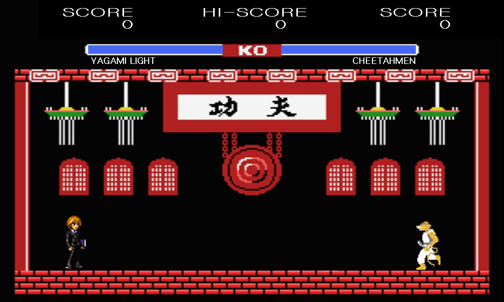

# charmugen

===============

##0.  들어가기 전에   
동아리 겨울방학 프로젝트로 만든 게임입니다.  
모티브가 된 게임은 킹 오브 파이터 등 2D 격투 게임 전반. 그 중에서도 mugen입니다.   
당시에 워크래프트 유즈맵 애니랜덤스킬을 많이 플레이해서, 그 영향으로 만든 게임입니다.  

- - -

##1. 소개 및 기능   
처음 제작한 격투게임입니다.   
2D 도트풍 감성을 나타내고 싶었던 게임입니다.   
현재 버전에서 캐릭터는 총 3개입니다.  

- - -

##2. 사용 키     
왼쪽 플레이어는 F G H T키와 Z X키,    
오른쪽 플레이어는 방향키와 . / 키를 사용합니다.

- - -

##3. 현재 시점에서의 감상    
캐릭터 추가가 힘들었던 것 같습니다. 2D 격투 게임 특성상 모션을 하나하나 만들어야 하다 보니까...    

만들 때는 별 문제가 없었는데 완성을 다 하고 시연을 하려니까 특정 스테이지에서 화면이 깜빡거리는 버그가 있었던 걸로 기억합니다. 제 환경에서는 별 문제 없었는데 시연 컴퓨터에서 문제가 생기더군요.    

버그의 원인은 아마 특정 스테이지에 이스터 에그?를 넣으려는 시도 중에 프로그램 fps와 컴퓨터 하드웨어 fps가 차이가 나서 그랬지 않을까 합니다. 

- - -

##4. Release Note   
>2015년 3월 첫 제작?